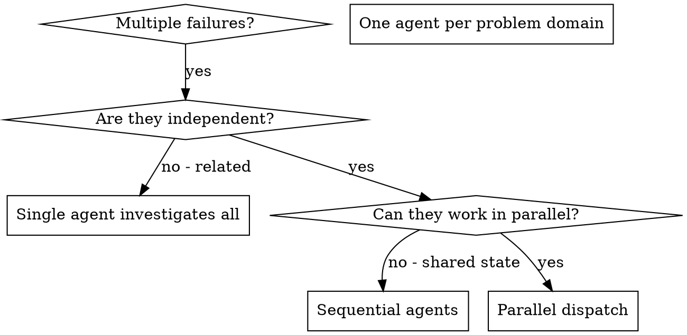

# Dispatching Parallel Agents

## Overview

When you have multiple unrelated failures (different test files, different subsystems, different bugs), investigating them sequentially wastes time. Each investigation is independent and can happen in parallel.

**Core principle:** Dispatch one agent per independent problem domain. Let them work concurrently.

## When to Use



**Use when:**
- 3+ test files failing with different root causes
- Multiple subsystems broken independently
- Each problem can be understood without context from others
- No shared state between investigations

**Don't use when:**
- Failures are related (fix one might fix others)
- Need to understand full system state
- Agents would interfere with each other

## The Pattern

### 1. Identify Independent Domains

Group failures by what's broken:
- File A tests: Tool approval flow
- File B tests: Batch completion behavior
- File C tests: Abort functionality

Each domain is independent - fixing tool approval doesn't affect abort tests.

**For C# .NET Projects (ECTSystem):**

Group failures by service/layer:
- `AF.ECT.Tests/Unit/WorkflowServiceTests.cs`: gRPC service validation logic
- `AF.ECT.Tests/Unit/WorkflowDataServiceTests.cs`: EF Core data access queries
- `AF.ECT.Tests/Integration/WorkflowIntegrationTests.cs`: End-to-end gRPC + database

Or by component:
- Workflow service exceptions (RpcException handling)
- User authentication and audit logging
- Database migrations and schema changes

Each domain is independent - gRPC exception handling fixes don't affect EF Core query failures.

### 2. Create Focused Agent Tasks

Each agent gets:
- **Specific scope:** One test file or subsystem
- **Clear goal:** Make these tests pass
- **Constraints:** Don't change other code
- **Expected output:** Summary of what you found and fixed

### 3. Dispatch in Parallel

```csharp
// In Claude Code / AI environment for ECTSystem
Task("Fix AF.ECT.Tests/Unit/WorkflowServiceTests.cs failures")
Task("Fix AF.ECT.Tests/Unit/WorkflowDataServiceTests.cs failures")
Task("Fix AF.ECT.Tests/Integration/WorkflowIntegrationTests.cs failures")
// All three run concurrently
dotnet test AF.ECT.Tests --filter "ClassName" --no-build
```

### 4. Review and Integrate

When agents return:
- Read each summary
- Verify fixes don't conflict
- Run full test suite
- Integrate all changes

## Agent Prompt Structure

Good agent prompts are:
1. **Focused** - One clear problem domain
2. **Self-contained** - All context needed to understand the problem
3. **Specific about output** - What should the agent return?

```markdown
Fix the 3 failing tests in src/agents/agent-tool-abort.test.ts:

1. "should abort tool with partial output capture" - expects 'interrupted at' in message
2. "should handle mixed completed and aborted tools" - fast tool aborted instead of completed
3. "should properly track pendingToolCount" - expects 3 results but gets 0

These are timing/race condition issues. Your task:

1. Read the test file and understand what each test verifies
2. Identify root cause - timing issues or actual bugs?
3. Fix by:
   - Replacing arbitrary timeouts with event-based waiting
   - Fixing bugs in abort implementation if found
   - Adjusting test expectations if testing changed behavior

Do NOT just increase timeouts - find the real issue.

Return: Summary of what you found and what you fixed.
```

**For C# .NET Projects (ECTSystem):**

```markdown
Fix the 2 failing test files in AF.ECT.Tests:

**Agent 1: AF.ECT.Tests/Unit/WorkflowServiceTests.cs**
1. GetWorkflow_WithNullId_ThrowsRpcException - expects StatusCode.InvalidArgument but gets Internal
2. ApproveWorkflow_WithLockedWorkflow_ThrowsRpcException - expects StatusCode.FailedPrecondition

Root cause: gRPC exception handling not translating business logic errors to correct status codes.

Your task:
1. Read test expectations - which StatusCode should each scenario throw?
2. Check WorkflowServiceImpl - does it throw RpcException with correct StatusCode?
3. Fix by adding validation before service logic OR
4. Fix by mapping business exceptions to RpcException with appropriate StatusCode
5. Verify both tests pass

Do NOT just change test expectations - fix the actual service logic.

Return: Summary of which business logic errors map to which StatusCodes + test results.

**Agent 2: AF.ECT.Tests/Integration/EFCoreIntegrationTests.cs**
3. GetUsersByStatus_WithInactiveUsers_ReturnsOnlyInactive - query returns all users instead of filtering
4. CreateWorkflow_WithDuplicate_RaisesDbUpdateException - duplicate creation doesn't raise exception

Root cause: EF Core query logic or migration issue.

Your task:
1. Read test data setup - what state exists before query?
2. Check query in WorkflowDataService - filter logic correct?
3. Run test with EF Core logging enabled - see actual SQL generated
4. Fix by correcting LINQ query OR fixing database migration constraint
5. Verify both tests pass with InMemory + SQL Server

Do NOT mock the database - use real EF Core InMemoryDatabase.

Return: Summary of query/migration issue + test results.
```

## Common Mistakes

**❌ Too broad:** "Fix all the tests" - agent gets lost
**✅ Specific:** "Fix agent-tool-abort.test.ts" - focused scope

**❌ No context:** "Fix the race condition" - agent doesn't know where
**✅ Context:** Paste the error messages and test names

**❌ No constraints:** Agent might refactor everything
**✅ Constraints:** "Do NOT change production code" or "Fix tests only"

**❌ Vague output:** "Fix it" - you don't know what changed
**✅ Specific:** "Return summary of root cause and changes"

## When NOT to Use

**Related failures:** Fixing one might fix others - investigate together first
**Need full context:** Understanding requires seeing entire system
**Exploratory debugging:** You don't know what's broken yet
**Shared state:** Agents would interfere (editing same files, using same resources)

## Real Example from Session

**Scenario:** 6 test failures across 3 files after major refactoring

**Failures:**
- agent-tool-abort.test.ts: 3 failures (timing issues)
- batch-completion-behavior.test.ts: 2 failures (tools not executing)
- tool-approval-race-conditions.test.ts: 1 failure (execution count = 0)

**Decision:** Independent domains - abort logic separate from batch completion separate from race conditions

**Dispatch:**
```
Agent 1 → Fix agent-tool-abort.test.ts
Agent 2 → Fix batch-completion-behavior.test.ts
Agent 3 → Fix tool-approval-race-conditions.test.ts
```

**Results:**
- Agent 1: Replaced timeouts with event-based waiting
- Agent 2: Fixed event structure bug (threadId in wrong place)
- Agent 3: Added wait for async tool execution to complete

**Integration:** All fixes independent, no conflicts, full suite green

**Time saved:** 3 problems solved in parallel vs sequentially

## Key Benefits

1. **Parallelization** - Multiple investigations happen simultaneously
2. **Focus** - Each agent has narrow scope, less context to track
3. **Independence** - Agents don't interfere with each other
4. **Speed** - 3 problems solved in time of 1

## Verification

After agents return:
1. **Review each summary** - Understand what changed
2. **Check for conflicts** - Did agents edit same code?
3. **Run full suite** - Verify all fixes work together
4. **Spot check** - Agents can make systematic errors

## Real-World Impact

From debugging session (2025-10-03):
- 6 failures across 3 files
- 3 agents dispatched in parallel
- All investigations completed concurrently
- All fixes integrated successfully
- Zero conflicts between agent changes
