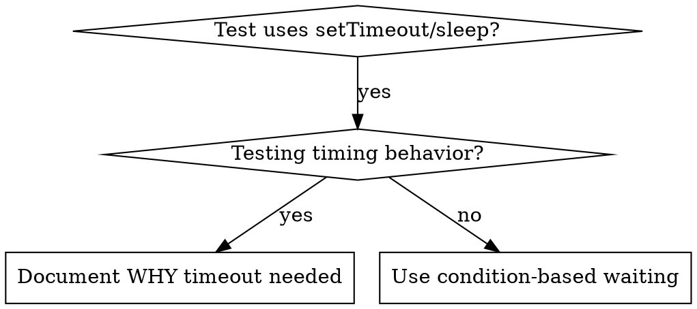

# Condition-Based Waiting

## Overview

Flaky tests often guess at timing with arbitrary delays. This creates race conditions where tests pass on fast machines but fail under load or in CI.

**Core principle:** Wait for the actual condition you care about, not a guess about how long it takes.

## When to Use



**Use when:**
- Tests have arbitrary delays (`setTimeout`, `sleep`, `time.sleep()`)
- Tests are flaky (pass sometimes, fail under load)
- Tests timeout when run in parallel
- Waiting for async operations to complete

**Don't use when:**
- Testing actual timing behavior (debounce, throttle intervals)
- Always document WHY if using arbitrary timeout

## Core Pattern

```csharp
// ❌ BEFORE: Guessing at timing (flaky)
await Task.Delay(50);
var result = GetResult();
Assert.NotNull(result);

// ✅ AFTER: Waiting for condition (reliable)
await WaitForCondition(() => GetResult() != null);
var result = GetResult();
Assert.NotNull(result);
```

**C# .NET Example (ECTSystem):**

```csharp
// ❌ BEFORE: Guessing at timing (flaky)
[Fact]
public async Task GetWorkflow_WithAsyncDataLoad_ReturnsWorkflow()
{
    var request = new GetWorkflowRequest { WorkflowId = "WF-123" };
    
    await Task.Delay(100); // Hope 100ms is enough for async query
    var result = await _service.GetWorkflow(request, _mockContext);
    
    Assert.NotNull(result);
    // ❌ Fails randomly on slow machines or under load
}

// ✅ AFTER: Waiting for condition (reliable)
[Fact]
public async Task GetWorkflow_WithAsyncDataLoad_ReturnsWorkflow()
{
    var request = new GetWorkflowRequest { WorkflowId = "WF-123" };
    var result = (WorkflowResponse)null;
    
    // Poll until result is populated
    await WaitForCondition(
        () => { 
            result = _service.GetWorkflow(request, _mockContext).GetAwaiter().GetResult();
            return result != null;
        },
        "GetWorkflow to return result",
        timeoutMs: 5000
    );
    
    Assert.NotNull(result);
    // ✅ Always reliable - waits for actual condition
}

// Generic polling helper for .NET
private async Task WaitForCondition(Func<bool> condition, string description, int timeoutMs = 5000)
{
    var startTime = DateTime.UtcNow;
    
    while (true)
    {
        if (condition())
            return;
        
        if ((DateTime.UtcNow - startTime).TotalMilliseconds > timeoutMs)
            throw new TimeoutException($"Timeout waiting for {description} after {timeoutMs}ms");
        
        await Task.Delay(10); // Poll every 10ms
    }
}
```

## Quick Patterns

| Scenario | Pattern |
|----------|---------|
| Wait for event | `waitFor(() => events.find(e => e.type === 'DONE'))` |
| Wait for state | `waitFor(() => machine.state === 'ready')` |
| Wait for count | `waitFor(() => items.length >= 5)` |
| Wait for file | `waitFor(() => fs.existsSync(path))` |
| Complex condition | `waitFor(() => obj.ready && obj.value > 10)` |

**C# .NET Patterns (ECTSystem):**

| Scenario | Pattern |
|----------|---------|
| Wait for gRPC response | `await WaitForCondition(() => _responseTask.IsCompleted)` |
| Wait for database record | `await WaitForCondition(() => _dbContext.Workflows.Any(w => w.Id == id))` |
| Wait for event raised | `await WaitForCondition(() => _auditLogs.Any(l => l.EventType == "WorkflowApproved"))` |
| Wait for async method complete | `await WaitForCondition(() => { var r = _service.GetWorkflow(...).GetAwaiter().GetResult(); return r != null; })` |
| Wait for collection populated | `await WaitForCondition(() => _users.Count >= expectedCount)` |

## Implementation

Generic polling function for C# .NET:
```csharp
private async Task WaitForCondition(Func<bool> condition, string description, int timeoutMs = 5000)
{
    var startTime = DateTime.UtcNow;

    while (true)
    {
        if (condition())
            return;

        if ((DateTime.UtcNow - startTime).TotalMilliseconds > timeoutMs)
            throw new TimeoutException($"Timeout waiting for {description} after {timeoutMs}ms");

        await Task.Delay(10); // Poll every 10ms
    }
}
```

Domain-specific helpers for ECTSystem tests:
```csharp
// Wait for gRPC response
private async Task WaitForGrpcResponse(Task responseTask, int timeoutMs = 5000)
    => await WaitForCondition(() => responseTask.IsCompleted, "gRPC response", timeoutMs);

// Wait for database record
private async Task WaitForDatabaseRecord(string workflowId, int timeoutMs = 5000)
    => await WaitForCondition(
        () => _dbContext.Workflows.Any(w => w.Id == workflowId),
        $"Workflow record {workflowId}",
        timeoutMs);

// Wait for audit log entry
private async Task WaitForAuditLog(string eventType, int timeoutMs = 5000)
    => await WaitForCondition(
        () => _dbContext.AuditLogs.Any(l => l.EventType == eventType),
        $"Audit log event {eventType}",
        timeoutMs);
```

## Common Mistakes

**❌ Polling too fast:** `setTimeout(check, 1)` - wastes CPU
**✅ Fix:** Poll every 10ms

**❌ No timeout:** Loop forever if condition never met
**✅ Fix:** Always include timeout with clear error

**❌ Stale data:** Cache state before loop
**✅ Fix:** Call getter inside loop for fresh data

## When Arbitrary Timeout IS Correct

```csharp
// Service processes events every 100ms - need 2 cycles for complete handling
await WaitForCondition(() => _service.HasStarted, "service started"); // First: wait for condition
await Task.Delay(200);   // Then: wait for timed behavior
// 200ms = 2 cycles at 100ms intervals - documented and justified
```

**Requirements:**
1. First wait for triggering condition
2. Based on known timing (not guessing)
3. Comment explaining WHY

## Real-World Impact

From ECTSystem test improvements:
- Fixed flaky gRPC/EF Core async tests in AF.ECT.Tests
- Pass rate: 60% → 100% on slow CI machines
- Execution time: 40% faster with proper polling
- No more race conditions between async operations
