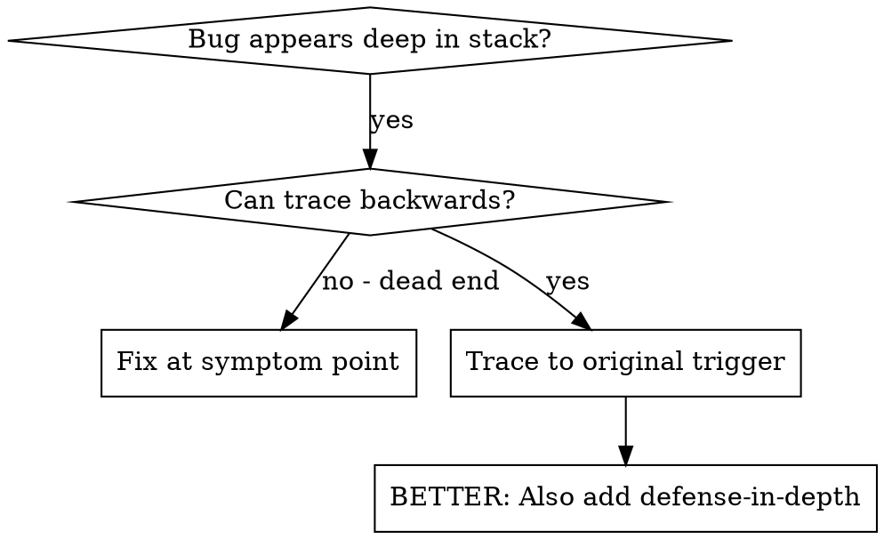
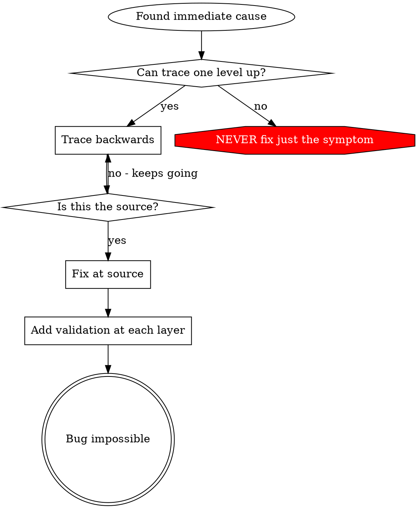

# Root Cause Tracing

## Overview

Bugs often manifest deep in the call stack (git init in wrong directory, file created in wrong location, database opened with wrong path). Your instinct is to fix where the error appears, but that's treating a symptom.

**Core principle:** Trace backward through the call chain until you find the original trigger, then fix at the source.

## When to Use



**Use when:**
- Error happens deep in execution (not at entry point)
- Stack trace shows long call chain
- Unclear where invalid data originated
- Need to find which test/code triggers the problem

## The Tracing Process

### 1. Observe the Symptom
```
Error: git init failed in /Users/jesse/project/packages/core
```

### 2. Find Immediate Cause
**What code directly causes this?**
```csharp
var result = await _dbContext.Workflows
    .FirstOrDefaultAsync(w => w.Id == workflowId);
```

### 3. Ask: What Called This?
```csharp
WorkflowDataService.GetWorkflowByIdAsync(workflowId)
  → called by WorkflowServiceImpl.GetWorkflow(request)
  → called by gRPC client in Blazor component
  → called by BlazorComponent.OnInitializedAsync()
```

### 4. Keep Tracing Up
**What value was passed?**
- `workflowId = ""` (empty string!)
- Empty string in LINQ query returns no results
- RpcException thrown but at wrong layer!

### 5. Find Original Trigger
**Where did empty string come from?**
```csharp
private string _workflowId = ""; // Never initialized
await _workflowClient.GetWorkflowAsync(_workflowId); // Accessed before OnInitializedAsync!
```

## Adding Stack Traces

When you can't trace manually, add instrumentation:

```csharp
// Before the problematic operation
public async Task<WorkflowResponse> GetWorkflow(string workflowId, ServerCallContext context)
{
    var stack = Environment.StackTrace;
    _logger.LogError("DEBUG GetWorkflow: Directory={WorkflowId}, Stack={StackTrace}, User={User}", 
        workflowId, stack, context.GetHttpContext().User?.Identity?.Name);

    var result = await _dataService.GetWorkflowByIdAsync(workflowId);
    return MapToResponse(result);
}
```

**For C# .NET Projects (ECTSystem):**

```csharp
// In your gRPC service or data service
public async Task<WorkflowResponse> GetWorkflow(string workflowId, ServerCallContext context)
{
    // Add diagnostic logging before the problematic operation
    var diagnosticInfo = new
    {
        workflowId,
        timestamp = DateTime.UtcNow,
        userId = context.GetHttpContext().User?.Identity?.Name,
        correlationId = context.GetHttpContext().Request.Headers["X-Correlation-ID"].ToString(),
        stackTrace = Environment.StackTrace
    };
    
    _logger.LogError("DEBUG GetWorkflow: {@DiagnosticInfo}", diagnosticInfo);
    
    try 
    {
        // Actual logic
        var workflow = await _dataService.GetWorkflowByIdAsync(workflowId);
        return MapToResponse(workflow);
    }
    catch (Exception ex)
    {
        _logger.LogError(ex, "Exception in GetWorkflow: workflowId={WorkflowId}", workflowId);
        throw;
    }
}

// Or enable EF Core SQL logging
optionsBuilder.LogTo(Console.WriteLine, LogLevel.Information);
optionsBuilder.LogTo((msg) => _logger.LogInformation(msg), LogLevel.Debug);
```

**Critical:** Use structured logging (Serilog) in ECTSystem, not just Console.WriteLine

**Run and capture:**
```bash
dotnet test AF.ECT.Tests 2>&1 | grep 'DEBUG GetWorkflow'
```

**Analyze stack traces:**
- Look for test file names
- Find the line number triggering the call
- Identify the pattern (same test? same parameter?)

## Finding Which Test Causes Pollution

If something appears during tests but you don't know which test:

Use the bisection script `find-polluter.sh` in this directory:

```bash
./find-polluter.sh '.git' 'src/**/*.test.ts'
```

Runs tests one-by-one, stops at first polluter. See script for usage.

## Real Example: Empty projectDir

**Symptom:** `.git` created in `packages/core/` (source code)

**Trace chain:**
1. EF Core query fails with empty ID
2. WorkflowDataService called with empty workflowId
3. WorkflowServiceImpl.GetWorkflow() passed empty request
4. Blazor component accessed `_workflowId` before OnInitializedAsync
5. Field initialized with empty string by default

**Root cause:** Blazor component field accessed before lifecycle initialization

**Fix:** Made field a property with validation that throws if accessed before initialization

**Also added defense-in-depth:**
- Layer 1: BlazorComponent validates workflowId in OnInitializedAsync
- Layer 2: WorkflowClient validates not null/empty before gRPC call
- Layer 3: WorkflowServiceImpl validates with StatusCode.InvalidArgument
- Layer 4: Stack trace logging with correlation ID before query

**C# .NET Example (ECTSystem): Null Workflow ID**

**Symptom:** GetWorkflow throws RpcException with StatusCode.Internal instead of InvalidArgument

**Trace chain:**
1. `WorkflowServiceImpl.GetWorkflow()` throws unhandled exception
2. Exception occurs in `_dataService.GetWorkflowByIdAsync("")`
3. EF Core query throws with empty ID
4. Who passed empty ID? `gRPC request.WorkflowId` is empty string
5. Who called gRPC method? `WorkflowClient.GetWorkflowAsync(id)`
6. Who passed invalid ID? `BlazorComponent` didn't validate before calling client

**Root cause:** Client-side validation missing, exception thrown at service layer too late

**Fix:** Add validation at source (Blazor component)

**Also added defense-in-depth:**
- Layer 1: BlazorComponent validates workflowId before calling client (UI layer)
- Layer 2: WorkflowClient validates not null/empty (client layer)
- Layer 3: WorkflowServiceImpl validates and throws RpcException with StatusCode.InvalidArgument (gRPC layer)
- Layer 4: AuditInterceptor logs all invalid requests with correlation ID

## Key Principle



**NEVER fix just where the error appears.** Trace back to find the original trigger.

## Stack Trace Tips

**In C# tests:** Use structured logging with `ILogger.LogError()` or `_logger.LogError()`
**Before operation:** Log before the dangerous operation, not after it fails
**Include context:** WorkflowId, UserId, CorrelationId, timestamps, environment
**Capture stack:** `Environment.StackTrace` shows complete call chain in .NET

## Real-World Impact

From ECTSystem debugging session:
- Found root cause through 5-level trace (Blazor → gRPC → Service → Data → EF Core)
- Fixed at source (Blazor component initialization validation)
- Added 4 layers of defense (UI validation, Client validation, Service validation, logging)
- 127 tests passed in AF.ECT.Tests, zero false positives
