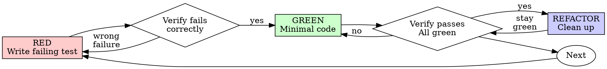

# Test-Driven Development (TDD)

## Overview

Write the test first. Watch it fail. Write minimal code to pass.

**Core principle:** If you didn't watch the test fail, you don't know if it tests the right thing.

**Violating the letter of the rules is violating the spirit of the rules.**

## When to Use

**Always:**
- New features
- Bug fixes
- Refactoring
- Behavior changes

**Exceptions (ask your human partner):**
- Throwaway prototypes
- Generated code
- Configuration files

Thinking "skip TDD just this once"? Stop. That's rationalization.

## The Iron Law

```
NO PRODUCTION CODE WITHOUT A FAILING TEST FIRST
```

Write code before the test? Delete it. Start over.

**No exceptions:**
- Don't keep it as "reference"
- Don't "adapt" it while writing tests
- Don't look at it
- Delete means delete

Implement fresh from tests. Period.

## Red-Green-Refactor



### RED - Write Failing Test

Write one minimal test showing what should happen.

<Good>
```csharp
// ✅ ECTSystem Pattern: xUnit with AAA pattern for async gRPC service
[Fact]
public async Task GetWorkflow_WithValidId_ReturnsWorkflow()
{
    // Arrange - Set up real dependencies (not mocks)
    var options = new DbContextOptionsBuilder<EctDbContext>()
        .UseInMemoryDatabase("test-db")
        .Options;
    
    using var context = new EctDbContext(options);
    context.Workflows.Add(new Workflow { Id = "WF-123", Name = "Test" });
    await context.SaveChangesAsync();

    var dataService = new WorkflowDataService(context);
    var service = new WorkflowServiceImpl(dataService);
    var mockContext = new Mock<ServerCallContext>();

    // Act
    var result = await service.GetWorkflow(
        new GetWorkflowRequest { WorkflowId = "WF-123" }, 
        mockContext.Object
    );

    // Assert
    Assert.NotNull(result);
    Assert.Equal("WF-123", result.WorkflowId);
    Assert.Equal("Test", result.Name);
}

// ✅ ECTSystem Pattern: Test exception handling in gRPC service
[Fact]
public async Task GetWorkflow_WithNullId_ThrowsRpcExceptionWithInvalidArgument()
{
    // Arrange
    var mockDataService = new Mock<IWorkflowDataService>();
    var service = new WorkflowServiceImpl(mockDataService.Object);
    var mockContext = new Mock<ServerCallContext>();

    // Act & Assert
    var exception = await Assert.ThrowsAsync<RpcException>(async () =>
        await service.GetWorkflow(new GetWorkflowRequest { WorkflowId = "" }, mockContext.Object)
    );
    
    Assert.Equal(StatusCode.InvalidArgument, exception.Status.StatusCode);
}

// ✅ ECTSystem Pattern: Test EF Core data access with InMemory database
[Fact]
public async Task CreateWorkflow_WithValidData_PersistsToDatabase()
{
    // Arrange
    var options = new DbContextOptionsBuilder<EctDbContext>()
        .UseInMemoryDatabase("create-test")
        .Options;

    using (var context = new EctDbContext(options))
    {
        var dataService = new WorkflowDataService(context);
        var workflow = new Workflow { Id = "WF-NEW", Name = "New Workflow" };

        // Act
        await dataService.CreateWorkflowAsync(workflow);

        // Assert - Verify database state changed
        var created = await context.Workflows.FindAsync("WF-NEW");
        Assert.NotNull(created);
        Assert.Equal("New Workflow", created.Name);
    }
}

// ✅ ECTSystem Pattern: Test Blazor component event handling
[Fact]
public async Task WorkflowComponent_OnApproveClick_CallsApproveService()
{
    // Arrange
    var mockWorkflowClient = new Mock<IWorkflowClient>();
    mockWorkflowClient.Setup(c => c.ApproveWorkflowAsync(It.IsAny<string>()))
        .ReturnsAsync(true);

    var component = new WorkflowApprovalComponent 
    { 
        WorkflowClient = mockWorkflowClient.Object,
        WorkflowId = "WF-123"
    };

    // Act
    await component.OnApproveClickAsync();

    // Assert
    mockWorkflowClient.Verify(c => c.ApproveWorkflowAsync("WF-123"), Times.Once);
    Assert.True(component.IsApproved);
}
```

**Clear xUnit names, AAA pattern, tests real behavior (InMemory DB), gRPC exceptions with status codes, service layer mocking only when necessary**
</Good>

<Bad>
```csharp
// ❌ Vague test name, unclear what behavior it tests
[Fact]
public async Task RetryWorks()
{
    var mock = new Mock<IOperation>();
    mock.SetupSequence(m => m.ExecuteAsync())
        .ThrowsAsync(new InvalidOperationException())
        .ThrowsAsync(new InvalidOperationException())
        .ReturnsAsync("success");
    await RetryHelper.RetryOperationAsync(mock.Object.ExecuteAsync);
    mock.Verify(m => m.ExecuteAsync(), Times.Exactly(3));
}

// ❌ Tests mock behavior not actual WorkflowService behavior
[Fact]
public async Task GetWorkflow_ReturnsData()
{
    var mockDataService = new Mock<IWorkflowDataService>();
    mockDataService.Setup(s => s.GetWorkflowByIdAsync(It.IsAny<string>()))
        .ReturnsAsync(new Workflow { Id = "123", Name = "Test" });
    
    var service = new WorkflowServiceImpl(mockDataService.Object);
    var result = await service.GetWorkflow(new GetWorkflowRequest { WorkflowId = "123" }, null);
    
    Assert.Equal("123", result.WorkflowId);  // Testing mock, not real behavior
}
```

**Vague name, tests mock not code, doesn't test actual EF Core queries or gRPC response mapping**
</Bad>

**Requirements:**
- One behavior
- Clear xUnit naming: `MethodUnderTest_Scenario_ExpectedResult`
- Real code (no mocks unless unavoidable)
- AAA pattern: Arrange, Act, Assert

### Verify RED - Watch It Fail

**MANDATORY. Never skip.**

```bash
# Run specific test in ECTSystem
dotnet test AF.ECT.Tests --filter "FullyQualifiedName~RetryOperation_RetriesFailedOperations_SucceedsAfterThirdAttempt" --no-build

# Or run all tests to see the failure
dotnet test AF.ECT.Tests --no-build
```

Confirm:
- Test fails (not build errors)
- Failure message shows expected vs actual
- Fails because feature missing (not compilation errors)
- For gRPC: Assert.ThrowsAsync shows status code or response mismatch
- For EF Core: InMemoryDatabase reflects test data changes

**Test passes?** You're testing existing behavior. Fix test.

**Test errors?** Fix compilation errors (check namespaces, using statements), re-run until it fails correctly.

### GREEN - Minimal Code

Write simplest code to pass the test.

<Good>
```csharp
public static class RetryHelper
{
    public static async Task<T> RetryOperationAsync<T>(Func<Task<T>> operation)
    {
        for (int i = 0; i < 3; i++)
        {
            try
            {
                return await operation();
            }
            catch when (i < 2)
            {
                // Retry
            }
        }
        return await operation();
    }
}
```
Just enough to pass
</Good>

<Bad>
```csharp
public static class RetryHelper
{
    public static async Task<T> RetryOperationAsync<T>(
        Func<Task<T>> operation,
        RetryOptions? options = null,
        ILogger? logger = null)
    {
        // YAGNI - add only what test requires
    }
}
```
Over-engineered
</Bad>

Don't add features, refactor other code, or "improve" beyond the test.

### Verify GREEN - Watch It Pass

**MANDATORY.**

```bash
# Run all tests in ECTSystem
dotnet test AF.ECT.Tests --no-build

# Or run specific test
dotnet test AF.ECT.Tests --filter "FullyQualifiedName~RetryOperation_RetriesFailedOperations_SucceedsAfterThirdAttempt" --no-build

# Verify no warnings introduced
dotnet build ECTSystem.sln /p:TreatWarningsAsErrors=true
```

Confirm:
- Test passes
- Other tests still pass
- Build output: 0 errors, 0 warnings
- gRPC call returns expected response or correct exception
- No CS* compiler warnings

**Test fails?** Fix code, not test.

**Other tests fail?** Fix now.

**Build warnings?** Fix warnings - don't suppress them.

### REFACTOR - Clean Up

After green only:
- Remove duplication
- Improve names
- Extract helpers

Keep tests green. Don't add behavior.

### Repeat

Next failing test for next feature.

## Good Tests

| Quality | Good | Bad |
|---------|------|-----|
| **Minimal** | One thing. "and" in name? Split it. | `test('validates email and domain and whitespace')` |
| **Clear** | Name describes behavior | `test('test1')` |
| **Shows intent** | Demonstrates desired API | Obscures what code should do |

## Why Order Matters

**"I'll write tests after to verify it works"**

Tests written after code pass immediately. Passing immediately proves nothing:
- Might test wrong thing
- Might test implementation, not behavior
- Might miss edge cases you forgot
- You never saw it catch the bug

Test-first forces you to see the test fail, proving it actually tests something.

**"I already manually tested all the edge cases"**

Manual testing is ad-hoc. You think you tested everything but:
- No record of what you tested
- Can't re-run when code changes
- Easy to forget cases under pressure
- "It worked when I tried it" ≠ comprehensive

Automated tests are systematic. They run the same way every time.

**"Deleting X hours of work is wasteful"**

Sunk cost fallacy. The time is already gone. Your choice now:
- Delete and rewrite with TDD (X more hours, high confidence)
- Keep it and add tests after (30 min, low confidence, likely bugs)

The "waste" is keeping code you can't trust. Working code without real tests is technical debt.

**"TDD is dogmatic, being pragmatic means adapting"**

TDD IS pragmatic:
- Finds bugs before commit (faster than debugging after)
- Prevents regressions (tests catch breaks immediately)
- Documents behavior (tests show how to use code)
- Enables refactoring (change freely, tests catch breaks)

"Pragmatic" shortcuts = debugging in production = slower.

**"Tests after achieve the same goals - it's spirit not ritual"**

No. Tests-after answer "What does this do?" Tests-first answer "What should this do?"

Tests-after are biased by your implementation. You test what you built, not what's required. You verify remembered edge cases, not discovered ones.

Tests-first force edge case discovery before implementing. Tests-after verify you remembered everything (you didn't).

30 minutes of tests after ≠ TDD. You get coverage, lose proof tests work.

## Common Rationalizations

| Excuse | Reality |
|--------|---------|
| "Too simple to test" | Simple code breaks. Test takes 30 seconds. |
| "I'll test after" | Tests passing immediately prove nothing. |
| "Tests after achieve same goals" | Tests-after = "what does this do?" Tests-first = "what should this do?" |
| "Already manually tested" | Ad-hoc ≠ systematic. No record, can't re-run. |
| "Deleting X hours is wasteful" | Sunk cost fallacy. Keeping unverified code is technical debt. |
| "Keep as reference, write tests first" | You'll adapt it. That's testing after. Delete means delete. |
| "Need to explore first" | Fine. Throw away exploration, start with TDD. |
| "Test hard = design unclear" | Listen to test. Hard to test = hard to use. |
| "TDD will slow me down" | TDD faster than debugging. Pragmatic = test-first. |
| "Manual test faster" | Manual doesn't prove edge cases. You'll re-test every change. |
| "Existing code has no tests" | You're improving it. Add tests for existing code. |

## Red Flags - STOP and Start Over

- Code before test
- Test after implementation
- Test passes immediately
- Can't explain why test failed
- Tests added "later"
- Rationalizing "just this once"
- "I already manually tested it"
- "Tests after achieve the same purpose"
- "It's about spirit not ritual"
- "Keep as reference" or "adapt existing code"
- "Already spent X hours, deleting is wasteful"
- "TDD is dogmatic, I'm being pragmatic"
- "This is different because..."

**All of these mean: Delete code. Start over with TDD.**

## Example: Bug Fix

**Bug:** WorkflowService accepts null workflow ID in gRPC call

**RED**
```csharp
[Fact]
public async Task GetWorkflow_WithNullId_ThrowsInvalidArgument()
{
    var mockContext = new Mock<ServerCallContext>();
    var mockDataService = new Mock<IDataService>();
    var service = new WorkflowServiceImpl(mockDataService.Object);
    
    await Assert.ThrowsAsync<RpcException>(async () =>
        await service.GetWorkflow(new GetWorkflowRequest { WorkflowId = "" }, mockContext.Object)
    );
}
```

**Verify RED**
```bash
$ dotnet test AF.ECT.Tests --filter "GetWorkflow_WithNullId" --no-build
FAIL: Expected RpcException not thrown
```

**GREEN** (in AF.ECT.Server/Services/WorkflowServiceImpl.cs)
```csharp
public override async Task<GetWorkflowResponse> GetWorkflow(
    GetWorkflowRequest request, ServerCallContext context)
{
    if (string.IsNullOrWhiteSpace(request.WorkflowId))
        throw new RpcException(new Status(StatusCode.InvalidArgument, "Workflow ID required"));
    
    var workflow = await _dataService.GetWorkflowByIdAsync(request.WorkflowId);
    return new GetWorkflowResponse { WorkflowId = workflow.Id };
}
```

**Verify GREEN**
```bash
$ dotnet test AF.ECT.Tests --filter "GetWorkflow_WithNullId" --no-build
PASS: 1 passed
```

**REFACTOR**
Consider extracting validation to separate validator method for reuse across gRPC methods.

## Verification Checklist

Before marking work complete:

- [ ] Every new public method has a test (gRPC services, data service methods, validators)
- [ ] Watched each test fail before implementing (RED phase verified)
- [ ] Each test failed for expected reason (feature missing, not build errors)
- [ ] Wrote minimal code to pass each test
- [ ] `dotnet test AF.ECT.Tests --no-build` shows all pass
- [ ] `dotnet build ECTSystem.sln` succeeds with 0 errors/warnings
- [ ] Tests use real code, real DbContext with InMemory (Moq only if unavoidable)
- [ ] Edge cases and exceptions covered (invalid input, null refs, RpcExceptions)
- [ ] Test names follow xUnit pattern: `MethodUnderTest_Scenario_ExpectedResult`
- [ ] For gRPC methods: test both success path and exception paths with correct StatusCode
- [ ] For EF Core: test with InMemoryDatabase, not mocks
- [ ] For Blazor components: test with JSRuntime mock, verify UI state changes
- [ ] No compiler warnings introduced (CS* errors)
- [ ] Audit logging interceptor called for applicable methods

Can't check all boxes? You skipped TDD. Start over.

## When Stuck

| Problem | Solution |
|---------|----------|
| Don't know how to test | Write wished-for API. Write assertion first. Ask your human partner. |
| Test too complicated | Design too complicated. Simplify interface. |
| Must mock everything | Code too coupled. Use dependency injection. |
| Test setup huge | Extract helpers. Still complex? Simplify design. |

## Debugging Integration

Bug found? Write failing test reproducing it. Follow TDD cycle. Test proves fix and prevents regression.

Never fix bugs without a test.

## Testing Anti-Patterns

When adding mocks or test utilities, read @testing-anti-patterns.md to avoid common pitfalls:
- Testing mock behavior instead of real behavior
- Adding test-only methods to production classes
- Mocking without understanding dependencies

## Final Rule

```
Production code → test exists and failed first
Otherwise → not TDD
```

No exceptions without your human partner's permission.
