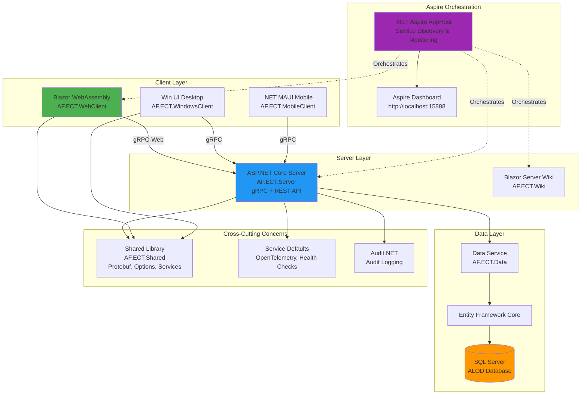
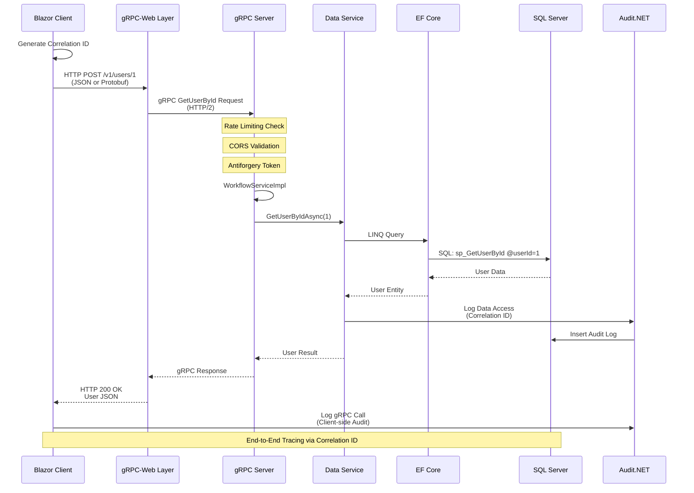
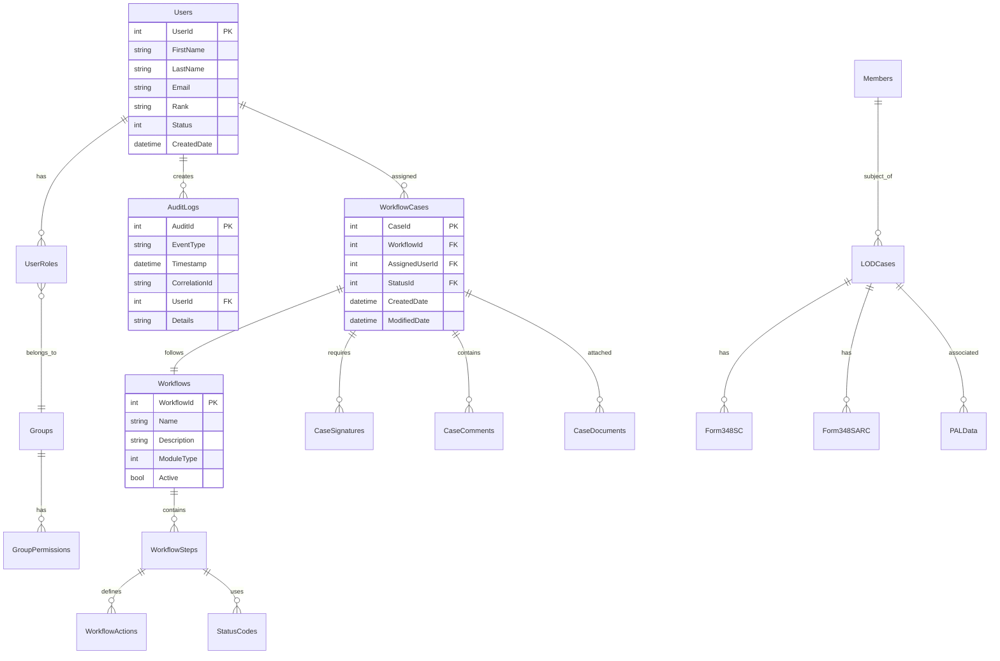
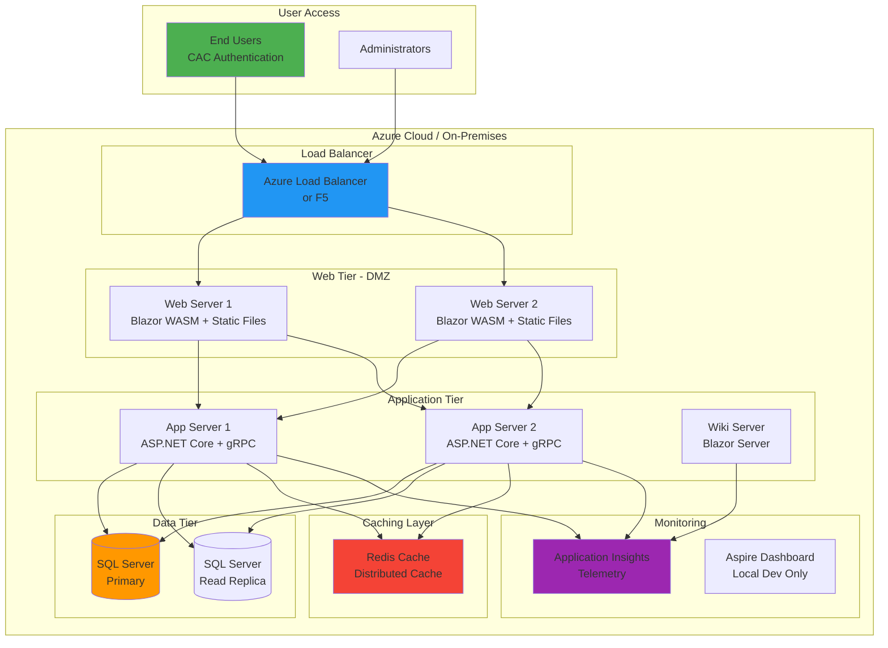
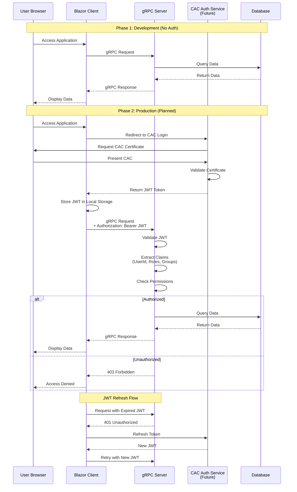
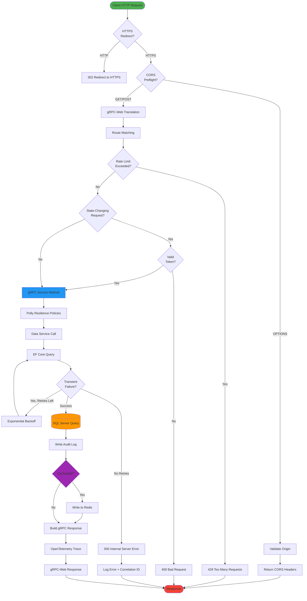
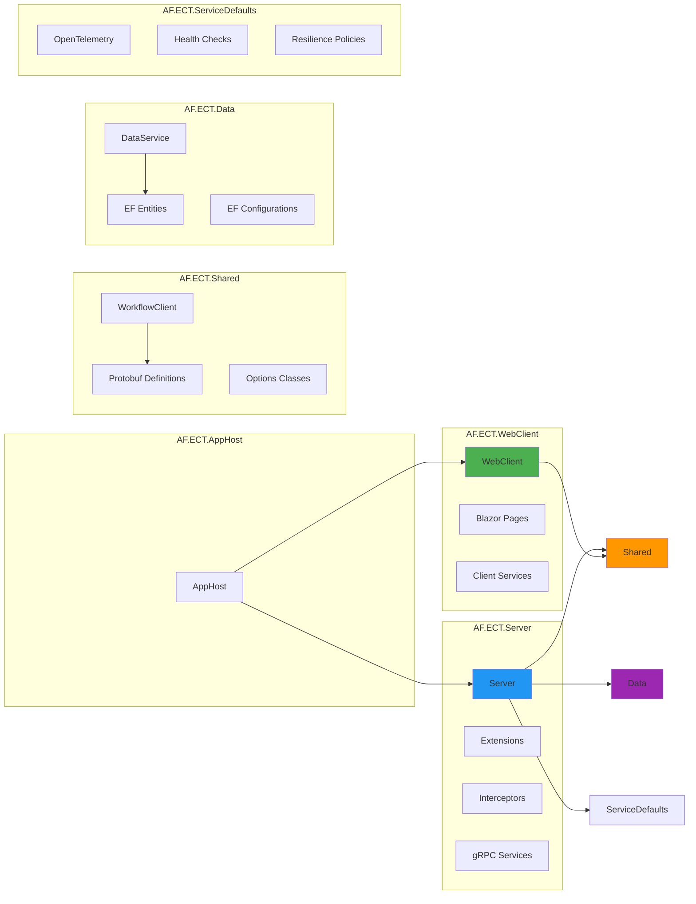

# ECTSystem Architecture Diagrams

This document contains visual architecture diagrams for the Electronic Case Tracking System.

## Table of Contents
- [System Architecture Overview](#system-architecture-overview)
- [gRPC Communication Flow](#grpc-communication-flow)
- [Database Schema Relationships](#database-schema-relationships)
- [Deployment Architecture](#deployment-architecture)
- [Authentication Flow](#authentication-flow)
- [Request Processing Pipeline](#request-processing-pipeline)

---

## System Architecture Overview

---

## gRPC Communication Flow

---

## Database Schema Relationships

---

## Deployment Architecture

---

## Authentication Flow

---

## Request Processing Pipeline

---

## Service Dependencies

---

## Legend

### Colors
- 🟢 **Green**: Client/User facing components
- 🔵 **Blue**: Server/API components  
- 🟠 **Orange**: Data/Database components
- 🟣 **Purple**: Infrastructure/Support components
- 🔴 **Red**: Error/End states

### Symbols
- **Rectangle**: Process or component
- **Cylinder**: Database or storage
- **Diamond**: Decision point
- **Circle**: Start/End point
- **Dotted line**: Management/orchestration relationship
- **Solid line**: Direct dependency or data flow

---

## Additional Resources

- [System Architecture Wiki](AF.ECT.Wiki/WikiPages/architecture.md)
- [API Documentation](API_DOCUMENTATION.md)
- [Contributing Guidelines](CONTRIBUTING.md)
- [README](README.md)

---

*Last Updated: October 26, 2025*  
*Diagrams created with Mermaid - View in GitHub or Markdown preview*
